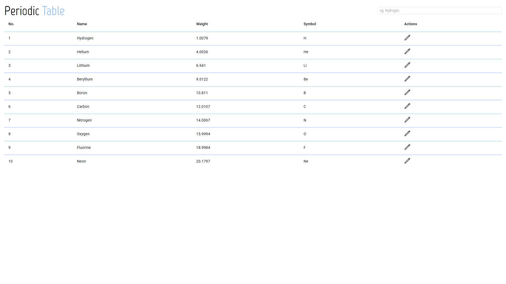
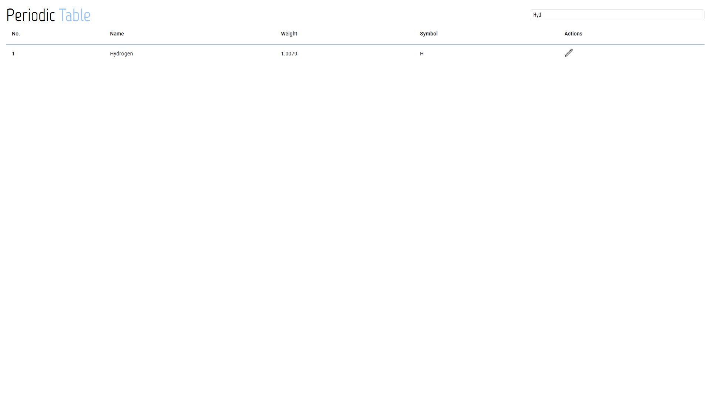
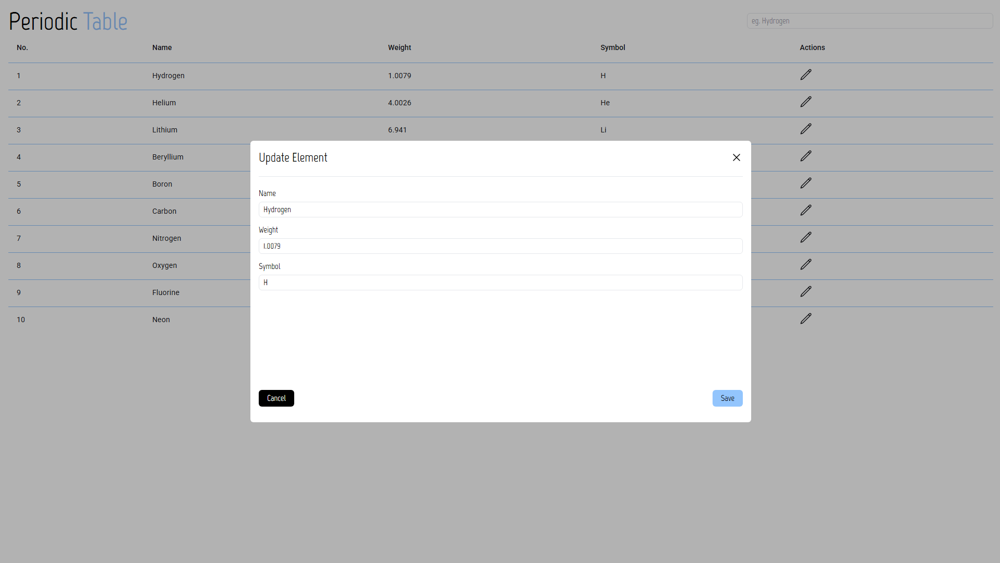
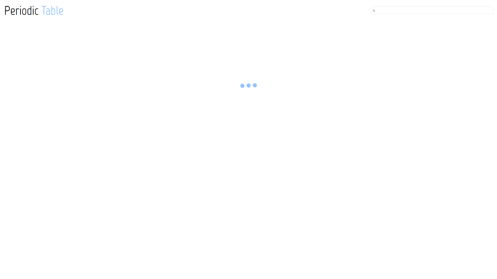

# 💻 Table of periodic elements

Recruitment task - Periodic Elements Table

## 🛠️ Technologies

- Angular 20
- TypeScript
- NgRX (Signal Store)
- TailwindCSS
- Angular Materials

## 🎯 Features

- ✅ View of the table with the elements of the periodic table
- ✅ Simulation of data fetching from Backend
- ✅ Ability to edit each table value via popup with simple form
- ✅ After saving updated value table automatically update
- ✅ Possibility to filter all values ​​through one input. Data is filtered after 2 seconds of no change in the given value

## 🧠 Author
- Daniel Miliczek
- GitHub: @ShadowBlack77

## 📸 Screenshots

